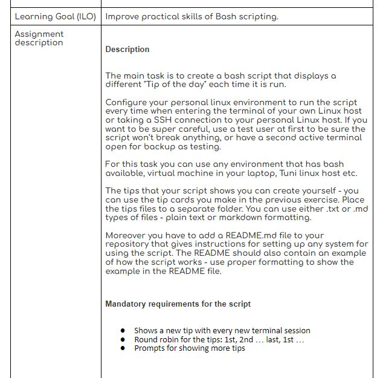
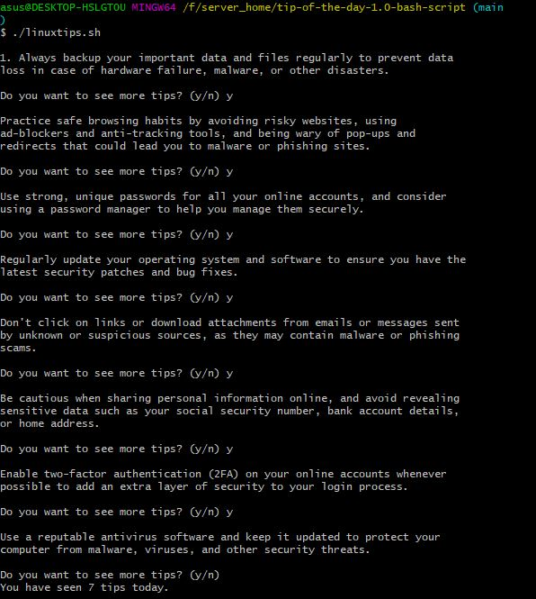

Question

Tip of the Day (linuxtips) Bash Script

The Tip of the Day (linuxtips) Bash script is a simple script that displays a 
different "tip of the day" each time it is run. The script reads a list of 
tip cards from a folder, and displays them in a round-robin fashion.

Requirements

Bash shell
Linux environment

Usage

1. Download or clone this repository to your local machine.

2. Navigate to the project directory in your terminal.

3. Edit the totd.sh script to add your own tip cards, or use the provided 
sample tip cards.

4. Make the totd.sh script executable by running chmod +x totd.sh.

5. Add the following line to the end of your .bashrc file in your home 
directory to automatically run the script every time you open a new 
terminal or SSH connection:

source /path/to/linuxtips_project/totd.sh

Make sure to replace "/path/to/linuxtips_project" with the actual path to your 
project folder.

6. Open a new terminal or SSH connection to see the first tip card 
displayed.

7.To see more tips, type "y" and press Enter. To permanently skip a tip, 
simply delete its corresponding tip card from the "tip_cards" folder.

Customization
Customize the script to fit your needs by:

>Editing the tip cards in the tip_cards folder. You can use either .txt or 
.md types of files - plain text or markdown formatting.
>Changing the prompt message to ask for showing more tips. In the linuxtips.sh 
script, find the line that reads read -p "Do you want to see more tips? 
(y/n) " SHOW_MORE, and edit the prompt message as desired.
>Modifying the behavior of the script, for example, to skip weekends or 
certain days. This would require modifying the logic in the totd.sh 
script.

Example

Here's an example of how the script works:

$ source /path/to/linuxtips_project/linuxtips.sh

Tip 1: Use the 'man' command to access manual pages for a command

Do you want to see more tips? (y/n) y

Tip 2: Use the 'history' command to view a list of recently executed 
commands

Do you want to see more tips? (y/n) n

as countie till 10 if selected y

In this example, the first tip card is displayed ("Tip 1: Use the 'man' 
command to access manual pages for a command"). The script then prompts 
the user if they want to see more tips. The user types "y" and presses 
Enter, and the second tip card is displayed ("Tip 2: Use the 'history' 
command to view a list of recently executed commands"). The script then 
prompts the user again, and this time the user types "n" and presses 
Enter, indicating that they don't want to see any more tips. The script 
then exits.

